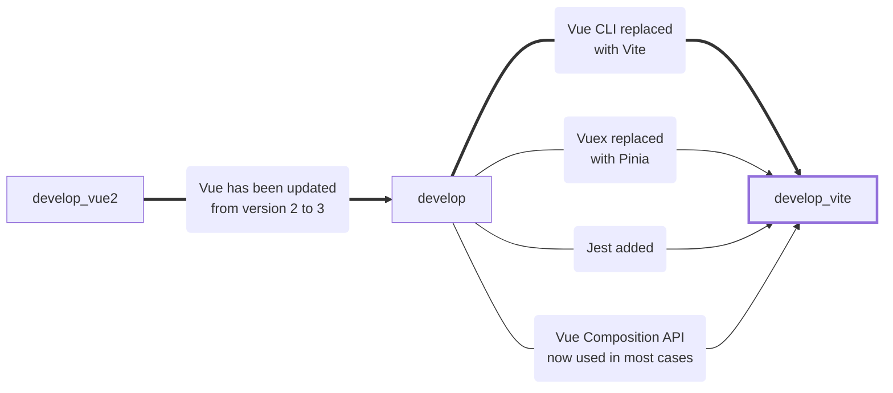

# CodeGlossary


## Project Setup:

```shell
# Setup
yarn install

# Runs and Hot-reload for development
yarn dev

# Compile
yarn build

# Run Test
yarn test
```

## Authors:
* [oredan](https://github.com/oredan) (Petrov Danil)
* [tatcray](https://github.com/tatcray) (Alina Yagubova)


### Current stack:
Vue 3 + TypeScript + Vuex + VueRouter + Vite + Jest

### The stack was changed three times during development:

