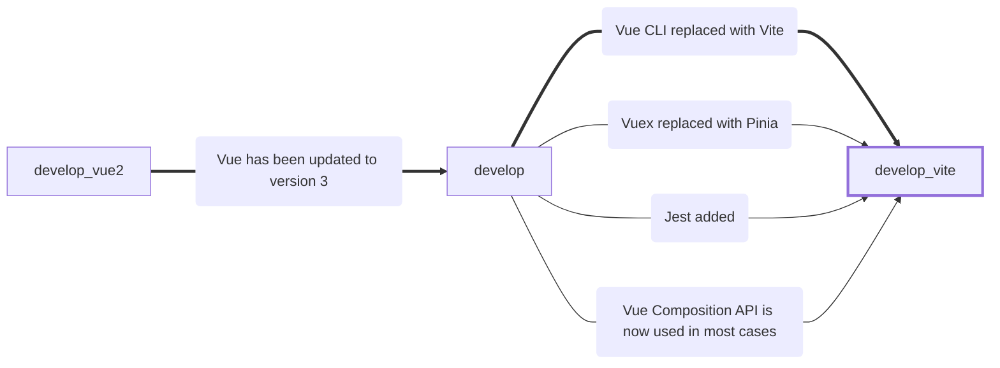

# CodeGlossary

### Authors:
* [oredan](https://github.com/oredan) (Petrov Danil)
* [tatcray](https://github.com/tatcray) (Alina Yagubova)

### Current stack:
### Vue 3 + TypeScript + Vuex + VueRouter + Vite + Jest

## The stack was changed three times in the project:

